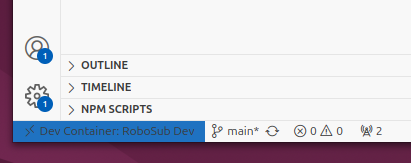

# RoboSub ROS 

This document has instructions to get you started. Read each section carefully.

## Setup (All Platforms)

If you have a Windows, Mac or Linux on your desktop you can use Docker and Development Containers in vscode to do local development. This is the fastest and easiest way to get setup and enables you to run the simulator and control the AUV on your computer. This is the recommended setup for everyone.

1. [Install vscode](https://code.visualstudio.com/)
1. [Install Docker Desktop](https://www.docker.com/products/docker-desktop/) 
    * Docker command line is sufficient on Linux
1. Follow the [Dev Containers Tutorial](https://code.visualstudio.com/docs/devcontainers/tutorial)
1. Follow the linked instructions on how to [clone a repository locally](https://code.visualstudio.com/docs/sourcecontrol/intro-to-git#_open-a-git-repository), login to GitHub and when prompted, put in the repository URL:

    ```
    https://github.com/CabrilloRoboticsClub/robosub_ros.git    
    ```
1. You will be prompted to re-open the folder in a **development container**. Select yes. Confirm that you have the devconainer open by looking at the bottom left corner of VScode. It should look like the picture below:

    

1. Create a Terminal in your vscode window with the `Terminal -> New Terminal` menu.

1. Initialize and update submodules.
    ```
    git submodule init
    git submodule update
    ```

## Quick Start 
Here are some steps to test your repository. **Run this command in the dev container terminal.**
1. Build the software in your dev container (do this from `/workspaces/robosub_ros`): 

    ```
    make
    ```

1. Source the `setup.bash` file after the build is complete.

    ```
    source install/setup.bash
    ```

1. Launch the lazershark simulation: 

    ```
    ros2 launch lazershark lazershark_sim.launch.py
    ```

1. Or launch the RPi: 
    ```
    ros2 launch lazershark pi.launch.py
    ```